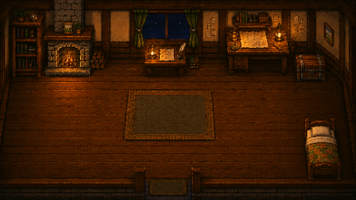
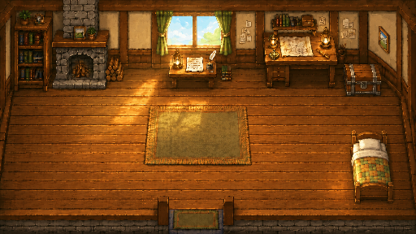

<p align="center">
  
</p>

<h1 align="center">炉火营地</h1>

<p align="center">
  <strong>把每一段真实专注，走成一段会被记住的旅途。</strong><br />
  本地优先的像素陪伴与远征记录应用 · 公开测试版
</p>

<p align="center">
  <a href="https://github.com/gxySkywalker/hearth-camp/releases/latest"><strong>下载 Windows 版</strong></a>
  · <a href="#快速开始">快速开始</a>
  · <a href="#功能一览">功能一览</a>
  · <a href="CHANGELOG.md">更新日志</a>
</p>



## 这是什么

以前我很喜欢 Forest、番茄 ToDo 这类专注软件。计时结束、数字增加、图表变长，当然会有成就感；可用久了以后，那些认真投入的时光很容易变成一行行冷冰冰的记录。

我想要的不是又一个披着游戏外皮的计时器，而是“走完一段路”的感觉。于是有了 **炉火营地**：一个温暖而神秘的中世纪像素世界，也是一间会在旅途尽头等你回来的炉火小屋。

现实中的每一次专注，都是一场真正的远征。你在制图桌安排当天的路标，带上一位伙伴出发；在路上可能遇见新地点、新伙伴、事件、宝藏、傍晚的商队，或是愿意赠你一首诗的吟游诗人。归来后，收获、同行与相遇会共同沉淀为属于你的旅途记忆。

回到小屋以后，你可以点燃炉火、整理背包、翻开诗集，或者什么也不做，只在炉火旁安静待一会儿。天文台会把真实投入过的时间汇成星轨；天使邮局则会送来每日星笺与每周旅途札记。填写可选 API Key 后，还可以收到更贴近实际旅途经历的来信。

这里没有断签惩罚、离线衰退、付费概率或被迫操作。伙伴也不是效率工具；它们会同行、相遇、成长，也会在小屋里等你归来。

> **v0.8.1 是当前 Windows 公开测试修复版。** 核心循环已可完整体验，数据默认只保存在你的电脑上。小屋与远征自带初始音乐；也可以由你用本地 BGM 包换成喜欢的声音。新加入的顶部像素专注窗会在你最小化或隐藏主窗口后守在屏幕上方，方便随时看见这一段旅途。

## 世界会慢慢长大

炉火营地仍在持续打磨。未来计划包括更完整的小镇系统、拥有自己生活与想法的居民、新伙伴、季节、节庆、更多随机事件，以及藏在世界角落里的彩蛋；这些均为后续规划，当前公开测试版尚未接入小镇内容。

但无论这个世界以后变得多大，它都会始终遵循同一个原则：

> **世界首先是家，然后才是一场漫长的冒险。**

希望在那些需要独自学习、工作与坚持的日子里，始终有一间亮着炉火的小屋，在旅途尽头等你回来；也希望你能在这里休息片刻，再一次勇敢地踏上新的旅途。

## 下载与安装

### Windows 10 / 11（64 位）

1. 前往 [Releases](https://github.com/gxySkywalker/hearth-camp/releases/latest)。
2. 下载最新版本中的 `炉火营地 Setup 0.8.1.exe`。
3. 双击安装，选择「仅为我安装」并按向导完成；无需管理员权限，随后从开始菜单或桌面启动「炉火营地」。

安装包目前未进行商业代码签名。若 Windows SmartScreen 显示来源提示，请只从本仓库的 Release 页面下载，并核对发布页提供的 SHA-256 校验值后再继续。安装器会自动修复指向不存在目录的旧快捷方式记录；覆盖升级不会影响本地存档。

### 添加自己的 BGM

炉火营地安装后即可播放小屋与远征的初始音乐。若你想换成自己创作、已取得授权或可合法使用的 MP3，也可以准备本地 BGM 包：

1. 在应用中打开「旅人手册 → 本地 BGM 包 → 打开 BGM 文件夹」。
2. 将两首 MP3 放入打开的文件夹，并使用以下**固定文件名**：
   - `cottage.mp3`：炉火小屋音乐；
   - `expedition.mp3`：远征音乐。
3. 重启炉火营地。程序会优先读取这两个本地文件；没有自定义文件时，会继续使用安装包自带的初始音乐。

音乐文件只保存在你的电脑上，不会写入存档、上传至 GitHub 或随问题反馈发送。请勿放入未获授权的音乐。

## 功能一览

| 从炉火小屋出发 | 结算后被世界记住 |
| --- | --- |
|  |  |
| 在可走动的小屋中与书柜、炉火、背包和伙伴互动。 | 远征会带回掉落、地图、事件、伙伴相遇与共同记忆。 |

### 真实远征

- 从制图桌选择路标，按 5 / 15 / 25 / 45 / 60 / 90 分钟规划远征。
- 支持暂停、系统休眠恢复与安全结算；休息不会打断远征音乐与旅途氛围。
- 白天、黄昏、黑夜会在出发时决定远征背景；旅途结束后依序展示收获、相遇与成长。
- 20 个共用事件与可拼合的手绘地图碎片，让新的地点慢慢加入远征池。

### 八位同行伙伴

- 八位伙伴拥有固定生态位、三阶段成长与分支形态；羁绊阈值与世界设定受到保护。
- 伙伴会在小屋中根据日光、傍晚与深夜呈现不同对话；每位伙伴也有自己的习惯与小毛病。
- 伙伴营地记录成长、图鉴、共同记忆与专属纪念物。成长表达关系的变化，而不是战力强化。

### 炉火、背包与旅途收获

- 背包可直接查看并使用旅行面包、山草药汤、珍稀蜜色琥珀等可用物品。
- 白天可点燃或熄灭炉火；夜晚炉火会自然燃起。药草束和蜜色琥珀碎片可以在炉火旁完成对应制作。
- 远征掉落分为普通、罕见、稀有、珍稀；商队会带来仅能以旧王朝铜币交换的旅途物品。

### 书信与诗集

- 天使邮局会送来每日星笺、每周旅途札记、节日与生日来信。
- AI 信件完全可选：不填写 Key 时，邮局会使用本地模板；填写后，Key 会安全保存在系统凭据中。
- 与商队相遇后可能遇见吟游诗人；赠诗会进入小屋书柜里的诗集，并保留获得日期。

### 旅程记录

- 制图桌整理旅途方向、目标分组与路标；进行中与已完成保持简单清晰。
- 天文台提供日、周维度的旅程观测。
- 冒险日志与共同记忆记录每次相遇、同行和抵达过的地方。
- 隐藏或最小化主窗口时，屏幕顶部会保留一扇高优先级置顶的像素专注窗：大号时间一眼可见，可自由拖动、单独关闭，也能随时回到旅途。

### 旅人形象与来信

- 可在「旅人手册」选择三位不同风格的冒险者形象；切换不会影响名字、伙伴、背包或旅途记录。
- 新旅人的初始称呼为「冒险者」。旧版默认称呼会自动迁移，玩家自行填写的名字保持不变。
- 小天使会以当前伙伴昵称整理后续信件，避免把同一位伙伴的旧成长名误写成两位同行。

## 隐私与数据

- 无账号、无云端同步、无遥测；学习记录和存档默认保留在本机。
- 背景音乐自带两首初始曲目；若你放入本地 BGM 包，应用仅读取数据目录下两个固定 MP3 覆盖它们，不上传、扫描或收集其他音乐文件。
- Windows 下，AI Key 使用系统 DPAPI 加密保存，不写入 SQLite、日志或仓库。
- 卸载应用前请自行备份存档。内测期间，建议在重要升级前保留一份副本。

## 开发

```powershell
npm install
npm run dev
```

```powershell
npm test       # 自动化测试
npm run build  # 生产构建与美术资源校验
npm run dist   # Windows NSIS 安装包
```

开发规范、世界设定、伙伴冻结边界与美术资料见 [docs/README.md](docs/README.md)。

## 反馈

欢迎通过 [Issues](https://github.com/gxySkywalker/hearth-camp/issues) 提交问题、体验感受或截图。公开测试阶段尤其欢迎反馈：安装与升级、远征结算、伙伴展示、小屋交互、邮局信件与性能表现。

---

<p align="center">愿每一次出发，都有炉火等你回来。</p>
