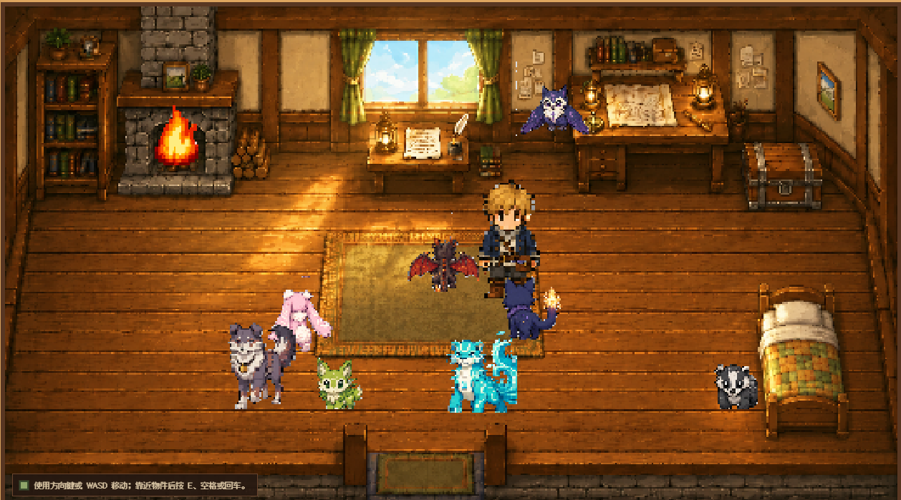
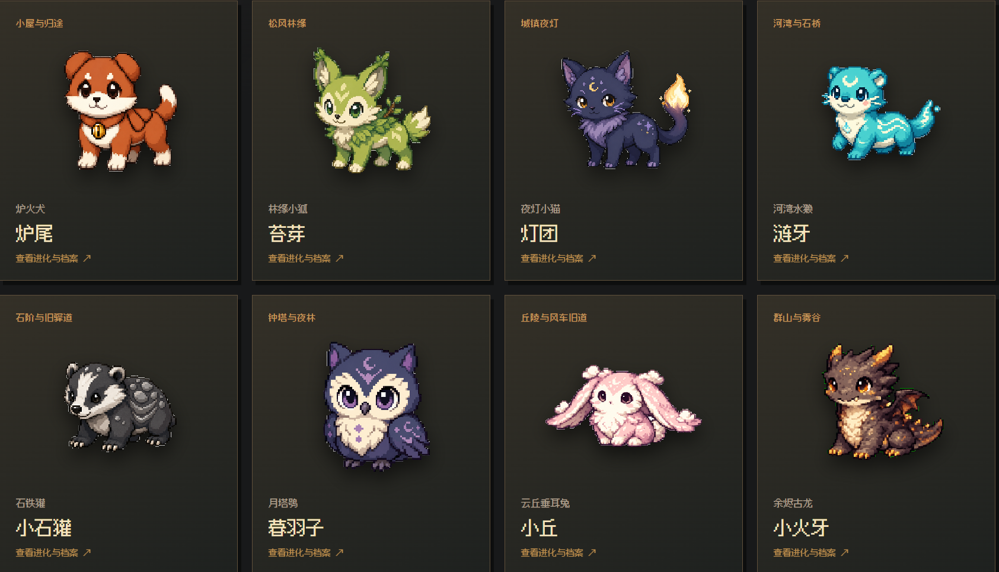
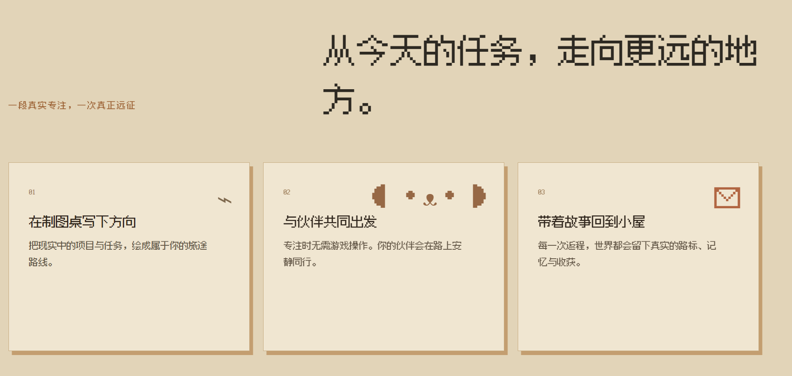
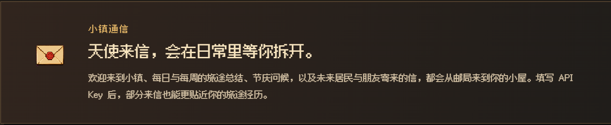
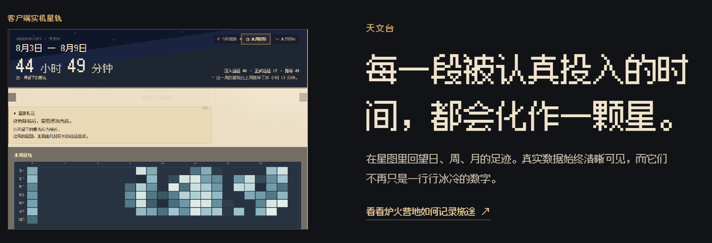

<p align="center">
  
</p>

<h1 align="center">炉火营地 · Hearth Camp</h1>

<p align="center">
  <strong>把每一段真实专注，走成一段会被记住的旅途。</strong><br />
  一个本地优先、像素风、以陪伴为核心的专注远征应用
</p>

<p align="center">
  <a href="https://github.com/gxySkywalker/hearth-camp/releases/latest"></a>
  <a href="https://github.com/gxySkywalker/hearth-camp/stargazers"></a>
  <a href="https://github.com/gxySkywalker/hearth-camp/issues"></a>
  
  
</p>

<p align="center">
  <a href="#快速了解">快速了解</a> ·
  <a href="#产品一览">产品一览</a> ·
  <a href="#下载与安装">下载与安装</a> ·
  <a href="#参与开发与反馈">参与开发与反馈</a>
</p>

> 炉火营地 v0.8.7 目前处于 Windows 公开测试阶段。项目由独立开发者持续迭代，欢迎带着真实体验、截图和建议回来。

## 快速了解

以前使用 Forest、番茄 ToDo 这类专注工具时，我总觉得还少了一点什么：计时结束、数字增加、图表变长，但那些认真投入的时光很快又变成冷冰冰的记录。

炉火营地想做的是另一种体验。你会来到王国边境的一间炉火小屋，带着伙伴从制图桌出发。现实中的每一次专注，都会成为一趟真正的远征：有路标、有天气般的昼夜、有相遇、有收获，也有一间亮着炉火的小屋在旅途尽头等你回来。

这里不追求连续打卡、效率排名或战力数值。伙伴不是工具，而是会同行、相遇、成长，并在小屋里拥有自己位置的朋友。

## 产品一览

<table>
  <tr>
    <td width="50%"></td>
    <td width="50%"></td>
  </tr>
  <tr>
    <td><strong>炉火小屋</strong><br />旅途尽头的家：点燃炉火、整理背包、翻开诗集，让伙伴们在屋里各自生活。</td>
    <td><strong>八位同行伙伴</strong><br />固定生态位、成长阶段与羁绊记忆都被认真保留；伙伴表达关系，不承担效率计算。</td>
  </tr>
  <tr>
    <td></td>
    <td></td>
  </tr>
  <tr>
    <td><strong>从制图桌出发</strong><br />写下今天的方向，选择 1–180 分钟的专注时长，带上一位伙伴走向更远的地点。</td>
    <td><strong>旅途收获</strong><br />宝藏、事件、地点、伙伴相遇、商队与吟游诗人，都会成为这次远征留下的故事。</td>
  </tr>
  <tr>
    <td></td>
    <td></td>
  </tr>
  <tr>
    <td><strong>天使邮局</strong><br />每日星笺与每周旅途札记会从小镇寄来；AI 润色完全可选，本地模板始终可用。</td>
    <td><strong>天文台</strong><br />把真实有效的专注时间汇成日、周、月与年度星历；暂停时间不会被伪装成投入。</td>
  </tr>
</table>

## 功能亮点

### 炉边手记，留给自己的纸页

- 在炉火旁写下正文、标题和清单；一页中可以自然混合不同文字大小与待办事项。
- 支持搜索、置顶、分类册和旧纸篓，空白新手记不会留下无效纸页。
- 手记仅保存在本机，不进入天使邮局、AI 来信上下文或任何旅途世界状态。

### 天文台记录真正走过的时间

- 今日观测、本周星图、本月星向与年度星历使用真实有效专注时长，暂停时间不会被计入。
- 年度星历以十二月星柱回望全年，并整理最明亮月份、最长一天、最长远征与旅途方向。
- 伙伴相遇与成长、吟游诗篇和初见地点也会成为年度星页的一部分，不把一年只缩成效率数字。

### 一次专注，一场远征

- 在制图桌安排方向、目标分组与备注，专注时长可在 1–180 分钟之间自由调节。
- 支持暂停、休息、系统休眠恢复与安全结算；暂停的时间不会污染冒险日志和天文台数据。
- 出征背景依据出发时段确定为白天、黄昏或黑夜，旅途中保持稳定的视觉氛围。
- 结算后依次呈现宝藏、伙伴、商队、吟游诗人与成长等内容，避免多个面板互相覆盖。

### 伙伴会陪你生活

- 八位伙伴拥有冻结的生态位、性格、生活习惯、成长规则与羁绊阈值。
- 伙伴可以同行、留在原地或在小屋里自由活动；每位伙伴都有自己的对话、纪念物与进化链。
- 伙伴营地会按页整理同行者与共同记忆；相遇、抵达、成长与形态抉择都能被慢慢翻回来看。
- 羁绊成长表达关系变化，而不是把伙伴做成数值或效率工具。

### 小屋是一间真正的家

- 炉火、书柜、背包、宝箱和伙伴都可以在小屋中自然接近并交互。
- 诗集会记录吟游诗人赠送的诗句与获得日期；背包可以直接查看、使用和赠送物品。
- 炉火、木地板、地毯、奖励与成长拥有独立的像素音效，且与小屋和远征场景分别管理。

### 记忆会留下来

- 20 个共用事件、可拼合的地图碎片、远征地点、共同记忆与冒险日志共同组成世界的长期轨迹。
- 吟游诗人独立于商队出现，赠诗不重复，并会留下常规相遇礼物。
- 隐藏或最小化主窗口时，可打开可拖动、可关闭的置顶像素专注小窗；时间、任务与色调都能快速确认。

## 本地优先与隐私

- 无账号、无云端同步、无遥测；存档、伙伴、背包、信件和远征记录默认保存在本机。
- AI 来信是可选能力。不填写 API Key 时使用本地模板；填写后，Key 通过 Windows DPAPI 加密保存，不写入 SQLite、日志或仓库。
- 小屋与远征自带初始 BGM，也支持在「旅人手册 → 本地 BGM 包」中替换为自己创作或已获授权的 `cottage.mp3` 与 `expedition.mp3`。
- 升级前建议备份本地存档。卸载应用前请先保留存档副本。

## 下载与安装

### Windows 10 / 11（64 位）

1. 前往 [最新 Release](https://github.com/gxySkywalker/hearth-camp/releases/latest)。
2. 下载 `Hearth-Camp-Setup-0.8.7.exe`。
3. 双击安装并按向导完成；安装后从开始菜单或桌面启动「炉火营地」。

安装包目前未进行商业代码签名。如果 Windows SmartScreen 提示来源，请确认文件来自本仓库 Release 页面，并核对发布页中的 SHA-256。覆盖升级不会清空已有存档。

## 开发者入口

```powershell
npm install
npm run dev
```

```powershell
npm test       # 自动化测试
npm run build  # 生产构建与资源校验
npm run dist   # Windows NSIS 安装包
```

项目采用 Electron + React + TypeScript + Vite + SQLite/sql.js，本地状态由明确的数据边界管理；像素场景使用 Pixi.js，AI 来信通过可选的 OpenAI 兼容接口接入。世界圣经、伙伴冻结边界与美术规范见 [`docs/PROJECT_HANDOFF.md`](docs/PROJECT_HANDOFF.md)、[`docs/WORLD_BIBLE.md`](docs/WORLD_BIBLE.md) 与 [`docs/README.md`](docs/README.md)。

## 参与开发与反馈

欢迎通过 [Issues](https://github.com/gxySkywalker/hearth-camp/issues) 提交问题、体验感受或截图，尤其欢迎反馈安装与升级、远征结算、伙伴行为、小屋交互、天使邮局、性能与可访问性。

如果你希望贡献代码，请先阅读交接文档中的设计红线：八位伙伴、成长规则、世界状态边界与暂停的小镇原型均不可擅自重构或重新接入。

## 路线图

- 更完整的小镇系统与居民生活（当前仍是暂停中的后续方向）
- 更多伙伴、季节、节庆、随机事件与世界彩蛋
- 更丰富的本地化、可访问性与跨平台打包评估

> 世界首先是家，然后才是一场漫长的冒险。

<p align="center">愿每一次出发，都有炉火等你回来。</p>
